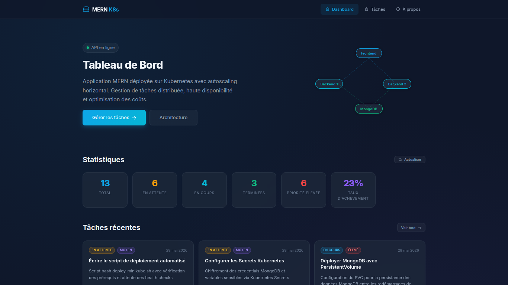
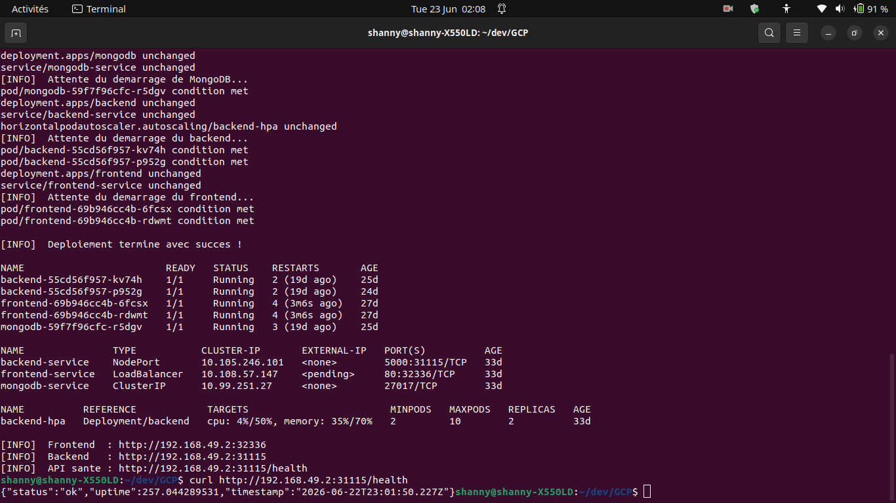
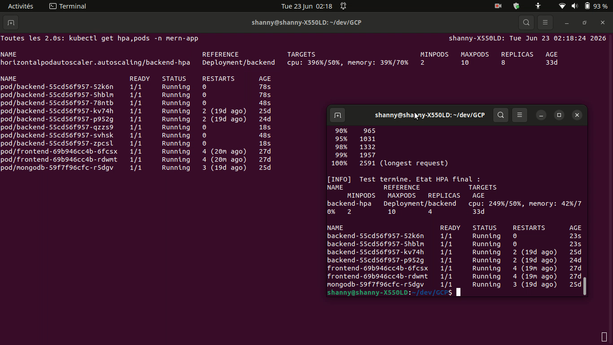
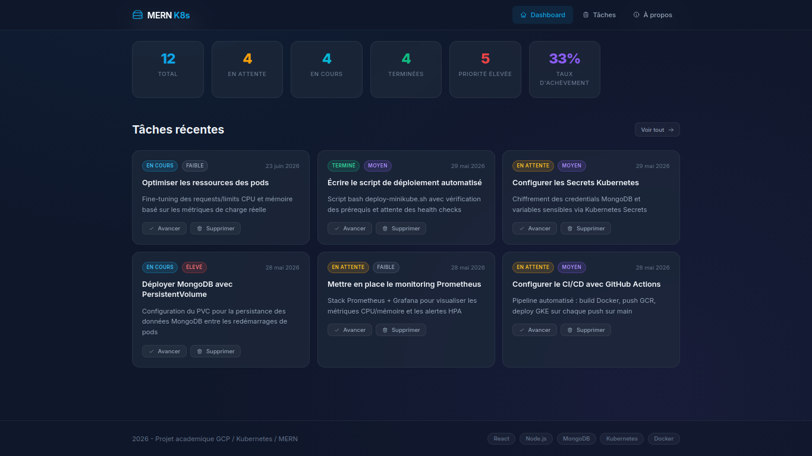
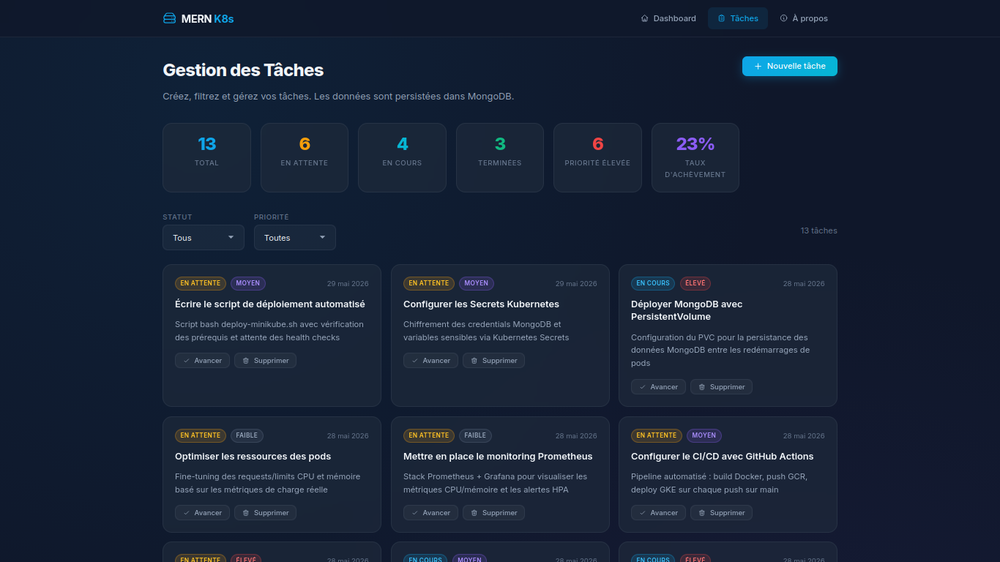
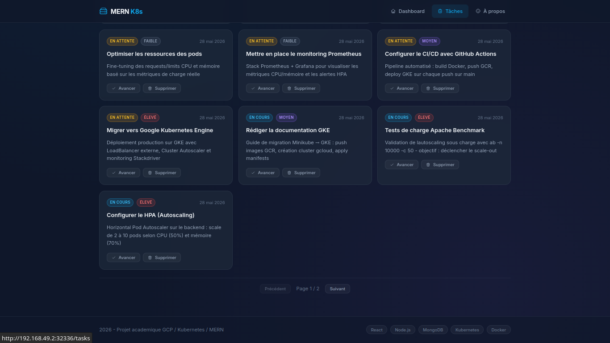
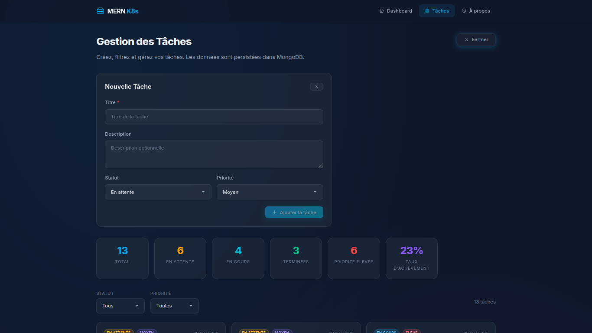
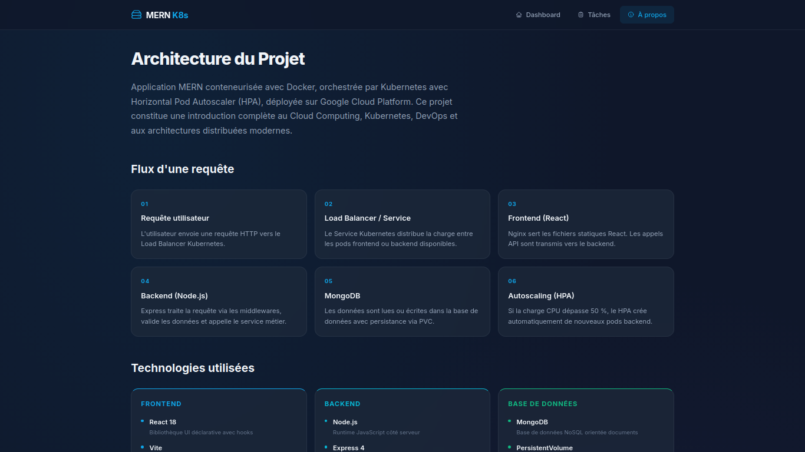
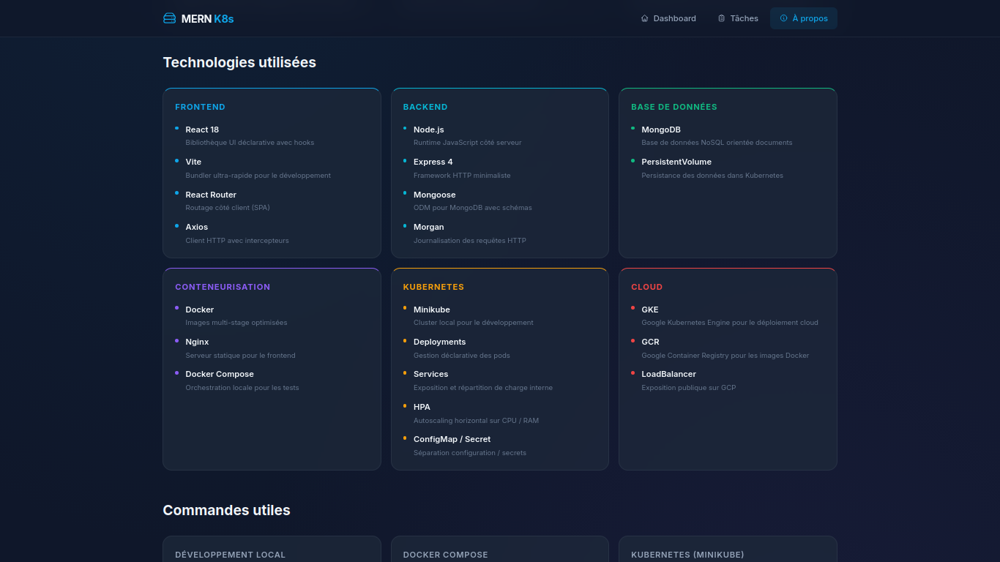
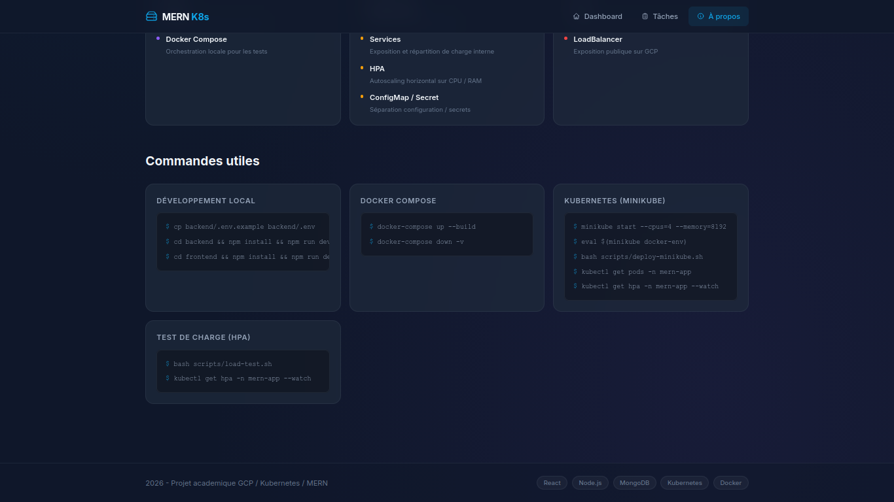

# MERN K8s — Application MERN sur Kubernetes avec HPA


Application web MERN (MongoDB, Express, React, Node.js) conteneurisée avec Docker
et orchestree par Kubernetes avec Horizontal Pod Autoscaler (HPA).
Deploiement sur cluster local (Minikube) et Google Cloud Platform (GKE).

## Architecture

```
Frontend (React + Vite)
        |
   Kubernetes Service (NodePort / LoadBalancer)
        |
Backend (Node.js + Express)  x2..10 pods (HPA)
        |
   Kubernetes Service (ClusterIP)
        |
MongoDB (PersistentVolume)
```

## Demarrage rapide — Developpement local

### Prerequis

- Node.js 20+
- MongoDB en cours d'execution localement (ou Docker)

### Installation

```bash
# Backend
cd backend
cp .env.example .env
npm install
npm run dev

# Frontend (nouveau terminal)
cd frontend
npm install
npm run dev
```

Frontend : http://localhost:5173
Backend  : http://localhost:5000

### Seeder la base de donnees

```bash
cd backend && node ../scripts/seed-db.js
```

---

## Demarrage avec Docker Compose

```bash
# Build et demarrage de tous les services
docker-compose up --build

# Arreter et supprimer les volumes
docker-compose down -v
```

Frontend : http://localhost:3000
Backend  : http://localhost:5000

---

## Deploiement Kubernetes (Minikube)

### Prerequis

```bash
# Verifier les outils
minikube version
kubectl version --client
docker version
ab -V   # Apache Benchmark (apache2-utils)
```

### Deploiement automatise

```bash
bash scripts/deploy-minikube.sh
```

Ce script effectue :

1. Demarrage de Minikube avec metrics-server
2. Build des images Docker dans le daemon Minikube
3. Application de tous les manifests Kubernetes dans l'ordre
4. Attente de la disponibilite de chaque composant
5. Affichage des URLs d'acces

### Commandes utiles

```bash
# Etat du cluster
kubectl get all -n mern-app

# Suivre le HPA en temps reel
kubectl get hpa -n mern-app --watch

# Logs du backend
kubectl logs -l app=backend -n mern-app --follow

# Acceder au frontend
minikube service frontend-service -n mern-app
```

---

## Test de charge (HPA)

```bash
# Test automatise 3 phases (100 -> 1000 -> 10000 requetes)
bash scripts/load-test.sh

# Ou manuellement
BACKEND_URL=$(minikube service backend-service -n mern-app --url)
ab -n 10000 -c 100 "${BACKEND_URL}/api/tasks"

# Observer l'autoscaling dans un autre terminal
kubectl get hpa -n mern-app --watch
```

---

## Deploiement GCP (GKE)

### 1. Creer un projet GCP et activer les APIs

```bash
gcloud projects create <votre-projet-id>
gcloud config set project <votre-projet-id>
gcloud services enable container.googleapis.com
```

### 2. Creer le cluster GKE

```bash
gcloud container clusters create mern-cluster \
  --num-nodes=3 \
  --machine-type=e2-medium \
  --region=europe-west1 \
  --enable-autoscaling \
  --min-nodes=1 \
  --max-nodes=5
```

### 3. Pousser les images sur GCR

```bash
PROJECT_ID=$(gcloud config get-value project)

# Backend
docker build -t gcr.io/$PROJECT_ID/mern-backend:latest ./backend
docker push gcr.io/$PROJECT_ID/mern-backend:latest

# Frontend
docker build -t gcr.io/$PROJECT_ID/mern-frontend:latest ./frontend
docker push gcr.io/$PROJECT_ID/mern-frontend:latest
```

### 4. Mettre a jour les images dans les manifests

Dans `k8s/backend/deployment.yaml` et `k8s/frontend/deployment.yaml`,
remplacer `image: mern-backend:latest` par `image: gcr.io/<votre-projet-id>/mern-backend:latest`.

### 5. Deployer sur GKE

```bash
gcloud container clusters get-credentials mern-cluster --region europe-west1

kubectl apply -f k8s/namespace.yaml
kubectl apply -f k8s/configmap.yaml
kubectl apply -f k8s/secret.yaml
kubectl apply -f k8s/mongodb/
kubectl apply -f k8s/backend/
kubectl apply -f k8s/frontend/
```

### 6. Acceder a l'application

```bash
# Changer le type de service en LoadBalancer dans k8s/frontend/service.yaml
kubectl get service frontend-service -n mern-app
# L'EXTERNAL-IP apparait apres quelques minutes
```

---

## Structure du projet

```
GCP/
- backend/              API Node.js/Express
  - src/
    - config/           Configuration et connexion DB
    - controllers/      Logique des routes (CRUD)
    - middleware/        Error handler, validation
    - models/           Schemas Mongoose
    - routes/           Definition des routes
    - services/         Logique metier
    - utils/            ApiError, logger
  - Dockerfile
  - server.js
- frontend/             Interface React (Vite)
  - src/
    - components/       Composants reutilisables
    - context/          State management (Context API)
    - hooks/            Custom hooks
    - pages/            Pages de l'application
    - services/         Client HTTP (axios)
  - Dockerfile
  - nginx.conf
- k8s/                  Manifests Kubernetes
  - mongodb/            PVC, Deployment, Service
  - backend/            Deployment, Service, HPA
  - frontend/           Deployment, Service
  - namespace.yaml
  - configmap.yaml
  - secret.yaml
- scripts/              Scripts d'automatisation
  - deploy-minikube.sh  Deploiement Minikube
  - load-test.sh        Test de charge Apache Benchmark
  - seed-db.js          Donnees de test
- docker-compose.yaml   Tests locaux complets
```

## API Endpoints

| Methode | Endpoint         | Description                  |
| ------- | ---------------- | ---------------------------- |
| GET     | /health          | Liveness probe Kubernetes    |
| GET     | /ready           | Readiness probe (verifie DB) |
| GET     | /api/tasks       | Liste des taches (paginees)  |
| GET     | /api/tasks/stats | Statistiques agregees        |
| GET     | /api/tasks/:id   | Detail d'une tache           |
| POST    | /api/tasks       | Creer une tache              |
| PUT     | /api/tasks/:id   | Modifier une tache           |
| DELETE  | /api/tasks/:id   | Supprimer une tache          |

### Parametres de filtrage (GET /api/tasks)

- `status` : `pending` | `in-progress` | `completed`
- `priority` : `low` | `medium` | `high`
- `page` : numero de page (defaut: 1)
- `limit` : taches par page (defaut: 10, max: 100)

## Technologies

| Composant     | Technologie            |
| ------------- | ---------------------- |
| Frontend      | React 18, Vite, Axios  |
| Backend       | Node.js 20, Express 4  |
| Base donnees  | MongoDB 7, Mongoose 8  |
| Serveur web   | Nginx 1.27             |
| Containers    | Docker (multi-stage)   |
| Orchestration | Kubernetes, Minikube   |
| Autoscaling   | HPA v2 (CPU + Memoire) |
| Cloud         | Google Cloud Platform  |
| Benchmark     | Apache Benchmark (ab)  |

## Fonctionnalités Principales

### 1. Gestion Complète des Tâches (CRUD)
- **Création & Édition** : Formulaire intuitif pour l'ajout et la modification avec gestion de la priorité (Basse, Moyenne, Haute) et du statut.
- **Liste Pagée et Filtrée** : Interface optimisée permettant de naviguer facilement dans de grandes quantités de tâches grâce à une pagination côté serveur.
- **Statistiques en Temps Réel** : Visualisation instantanée de l'avancement via le Dashboard (taux de complétion, répartition par priorité).

### 2. Architecture Cloud-Native & Haute Disponibilité
- **Conteneurisation Multi-Stage** : Images Docker ultra-légères pour le Frontend (Nginx) et le Backend (Node.js).
- **Autoscaling HPA** : Mise à l'échelle dynamique sur Kubernetes (de 2 à 10 Pods) en fonction de l'utilisation CPU/Mémoire pour absorber les pics de charge.
- **Sondes de Santé (Probes)** : Liveness et Readiness probes configurées pour garantir qu'aucun trafic n'est envoyé vers un Pod défectueux.

### 3. Automatisation et Tests de Charge
- **Scripts de Déploiement** : Un script unifié pour lancer le cluster Minikube, builder les images et appliquer les manifests.
- **Stress-Testing Intégré** : Utilisation d'Apache Benchmark pour simuler des dizaines de milliers de requêtes et valider la réactivité du HPA.

## Captures d'écran

### Déploiement et Autoscaling



### Dashboard



### Gestion des tâches




### À propos



